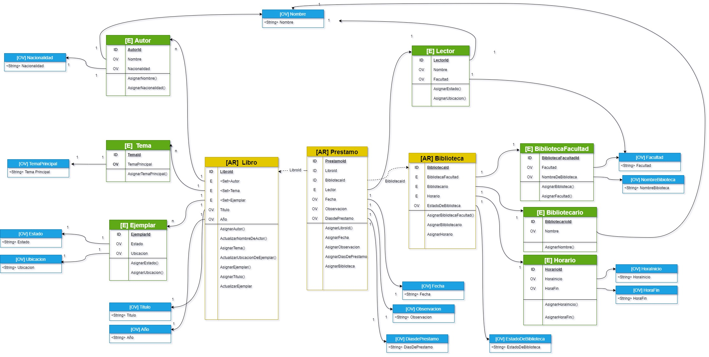

# DDD-Biblioteca
### CHALLENGE - HACIENDO DDD DESDE CERO
Para este reto se decidio hacer el ddd para una biblioteca

### Diseño y modelamiento

- En la implementacion se crearon 3 agregados ,2 de ellos con 3 entidades y el otro con 1 entidad
- se creo 15 objetos de valor
- se creo 10 casos de uso por comando
- se creo 2 casos de uso por evento(y uno que simula un mensaje)
- cada caso de uso tiene su test
### Use Case/Problem
Con base al conocimiento adquirido sobre DDD poner en evidencia el conocimiento y dominio adquirido de esta temática, para ello realizaremos lo siguiente:

Se debe definir un problema cualquiera sobre el cual se planteara un Modelo de Dominio diferente al Pet Project.
De manera individual se dará respuesta a la solución planteada expresada en el Modelo de Dominio y la librería de DDD.

Se deben tener en cuenta la siguientes directrices.

1. Se debe tener mínimo 2 agregado como mínimo
2. Se debe tener mínimo 3 entidades como mínimo por cada agregado.
3. Se debe tener mínimo 12 objetos de valor como mínimo
4. Se debe tener mínimo 12 comportamientos con sus respectivos eventos de dominio y/o comandos
5. Se debe tener mínimo 10 casos de uso disparados por comandos
6. Se debe tener mínimo 2 casos de uso disparados por eventos

